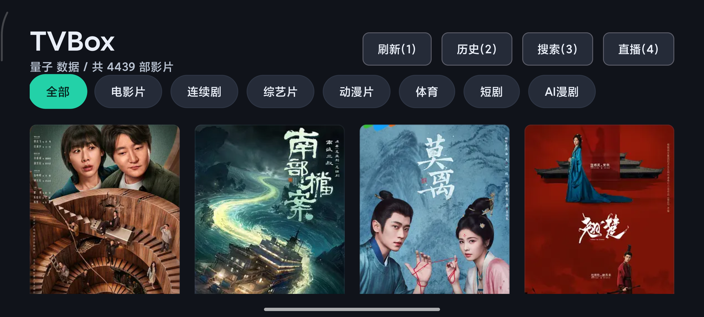

# TVBox

TVBox 是一个面向 Android TV / 电视盒子的影视播放应用，使用 Kotlin、Jetpack Compose 和 Media3 ExoPlayer 构建。应用重点适配遥控器操作，支持影视分类、搜索、详情、m3u8 播放、观看历史、电视直播和 OTA 更新。

> 请确保使用的影视与直播接口具备合法授权。本项目仅提供客户端能力，不内置或托管影视内容。

## 界面预览



## 功能特性

- Android TV 适配：支持 `LEANBACK_LAUNCHER`，可在电视桌面启动，同时保留普通 Android 启动入口。
- 遥控器友好：方向键、确认键、返回键、菜单键和数字键均有对应交互。
- 首页影视列表：支持一级/二级分类、分页加载、焦点高亮和遥控快捷键。
- 视频接口管理：设置页可选择量子、如意、360 等内置资源站，也可手机扫码添加 MacCms 自定义接口作为首页、搜索和 AI 找片默认数据源。
- 搜索与详情：支持关键词搜索、影片详情、简介、封面、播放源和选集。
- AI 找片：支持文字、应用内语音识别、快捷推荐词和“换一批”，可在设置页用手机扫码配置大模型、模型名和 API Key。
- 播放器：基于 Media3 ExoPlayer，支持 HLS/m3u8、播放/暂停、上一集、下一集、倍速切换、自动跳下一集和手机播放手势。
- 观看历史：记录影片、封面、播放线路、集数、播放进度和更新时间，可从历史继续播放。
- 电视直播：从 IPTV 文本接口加载频道，支持左右切台、频道列表、数字选台。
- OTA 更新：启动后检查 Gitee 仓库中的 `update.json`，发现新版本后可下载 APK 并跳转系统安装器。
- 内容过滤：过滤伦理、电影解说、演员、新闻资讯等不需要的分类或资源。

## 遥控器快捷键

首页：

| 按键 | 功能 |
| --- | --- |
| 数字 1 | 历史 |
| 数字 2 | 搜索 |
| 数字 3 | AI 找片 |
| 数字 4 | 直播 |
| 数字 5 | 设置 |
| 方向键 | 移动焦点 |
| 确认键 | 打开当前焦点内容 |
| 下滑到加载更多 | 自动加载下一页 |

播放器：

| 按键 | 功能 |
| --- | --- |
| 确认 / 播放暂停 | 播放或暂停 |
| 菜单键 | 切换倍速并显示当前倍速 |
| 数字 1 | 上一集 |
| 数字 3 | 下一集 |
| 返回键 | 返回详情页 |

直播：

| 按键 | 功能 |
| --- | --- |
| 方向左 / 右 | 上一个 / 下一个频道，支持首尾循环 |
| 确认 / 播放暂停 | 显示左侧频道列表 |
| 频道列表中方向上 / 下 | 立即切换频道 |
| 数字键 | 输入频道号，例如 `1`、`12` |
| 返回键 | 返回首页 |

## 安装

从 Release 下载最新 APK：

- [Latest Release](https://github.com/ZxxXinI/tvbox/releases/latest)
- [Gitee Release](https://gitee.com/zhen-xin/tv-box/releases)
- OTA 更新清单：`https://gitee.com/zhen-xin/tv-box/raw/agent/update.json`

通过 ADB 安装：

```powershell
adb install -r app\build\outputs\apk\release\app-release.apk
```

如果是从 Release 下载的 APK：

```powershell
adb install -r TVBox-v1.2.8.apk
```

## OTA 更新机制

应用启动后会请求：

```text
https://gitee.com/zhen-xin/tv-box/raw/agent/update.json
```

`update.json` 示例：

```json
{
  "versionCode": 10208,
  "versionName": "1.2.8",
  "apkUrl": "https://gitee.com/zhen-xin/tv-box/releases/download/v1.2.8/TVBox-v1.2.8.apk",
  "apkSha256": "598bef37d28f16898991395ea2a89e092c6320908f82ca381852d4e1403ab030",
  "apkSize": 4721013,
  "force": false,
  "changelog": [
    "新增设置页自定义视频接口，支持手机扫码添加 MacCms 接口。",
    "优化手机播放手势：双击左侧快退，中间播放/暂停，右侧快进。"
  ]
}
```

说明：

- `versionCode` 必须大于当前应用版本，才会提示更新。
- `apkUrl` 是 APK 下载地址，目前指向 Gitee Release 附件。
- `apkSha256` 用于下载完成后的完整性校验。
- `force` 预留强制更新能力，当前普通更新可选择稍后再说。
- `update.json` 放在仓库根目录，随代码推送到 Gitee 后，应用会通过 raw 地址读取。
- Gitee Release 需要上传 APK 附件；GitHub Release 可以继续作为备份。
- `git push` 只会上传代码和 tag，不会自动上传 Release 附件。

## 本地构建

环境要求：

- JDK 17
- Android SDK
- 使用项目内 Gradle Wrapper

AI 找片配置：

- APK 默认使用打包时配置的 `TVBOX_AI_API_KEY` 和内置 Agnes 参数。
- 用户可在设置页选择 Agnes、DeepSeek、SiliconFlow 或 Qwen。
- 模型名称和 API Key 不需要用遥控器输入；点击“模型”或“API Key”按钮后，电视会弹出二维码，手机扫码填写后自动同步到电视。
- 设置页只有手机提交了 API Key 后才会覆盖 APK 内置 AI 配置；未填写时继续使用默认配置。

打包时的默认 API Key 可放在本地配置中：

```properties
TVBOX_AI_API_KEY=你的测试密钥
```

`TVBOX_AI_API_KEY` 可以放在 `local.properties`、Gradle 属性或环境变量中。`local.properties` 已被 `.gitignore` 忽略，不会上传到仓库。

视频接口配置：

- 内置视频接口保留在 APK 中，不会被用户配置覆盖。
- 设置页“视频接口”可选择当前首页、搜索和 AI 找片使用的数据源。
- 点击“添加接口”后，电视弹出二维码；手机扫码填写接口名称和 MacCms 地址，确认后自动同步到电视。
- MacCms 地址示例：`https://example.com/api.php/provide/vod`

运行测试：

```powershell
.\gradlew.bat testDebugUnitTest --console=plain
```

构建 debug APK：

```powershell
.\gradlew.bat assembleDebug --console=plain
```

构建 release APK：

```powershell
.\gradlew.bat assembleRelease --console=plain
```

release APK 输出位置：

```text
app\build\outputs\apk\release\app-release.apk
```

## Release 签名

release 签名信息从 `local.properties`、Gradle 属性或环境变量读取，密钥文件不会提交到仓库。

需要配置：

```properties
TVBOX_RELEASE_STORE_FILE=signing/xxx.jks
TVBOX_RELEASE_STORE_PASSWORD=***
TVBOX_RELEASE_KEY_ALIAS=***
TVBOX_RELEASE_KEY_PASSWORD=***
```

签名校验：

```powershell
apksigner verify --print-certs app\build\outputs\apk\release\app-release.apk
```

## 发布新版本流程

1. 修改版本号：

```kotlin
versionCode = 10208
versionName = "1.2.8"
```

2. 构建 release APK：

```powershell
.\gradlew.bat testDebugUnitTest --console=plain
.\gradlew.bat assembleRelease --console=plain
```

3. 提交代码并打 tag：

```powershell
git add CHANGELOG.md README.md update.json app\build.gradle.kts app\src devLog
git commit -m "Release v1.2.8"
git tag -a v1.2.8 -m "TVBox v1.2.8"
git push origin agent
git push origin v1.2.8
git push gitee agent
git push gitee v1.2.8
```

4. 更新根目录 `update.json`，其中 `apkUrl` 指向 Gitee Release APK。

5. 在 Gitee Release 上传对应版本 APK：

```text
TVBox-v1.2.8.apk
```

6. 可选：在 GitHub Release 上传或覆盖备份附件：

```powershell
gh release upload v1.2.8 app\build\outputs\apk\release\TVBox-v1.2.8.apk app\build\outputs\apk\release\update.json --repo ZxxXinI/tvbox --clobber
```

> Gitee Release 目前建议在网页端创建并上传 APK；GitHub Release 可继续使用 `gh` 命令维护备份。

## 项目结构

```text
app/src/main/java/com/tvbox/app
├── data        # API、仓库、历史记录、OTA、直播数据
├── domain      # 领域模型与解析规则
├── ui          # Compose 页面、播放器、直播页
└── MainActivity.kt
```

## 技术栈

- Kotlin
- Jetpack Compose
- Compose for TV 基础能力
- Media3 ExoPlayer
- Retrofit / OkHttp
- kotlinx.serialization
- Coil

## 版本记录

详细变更见 [CHANGELOG.md](CHANGELOG.md)。
