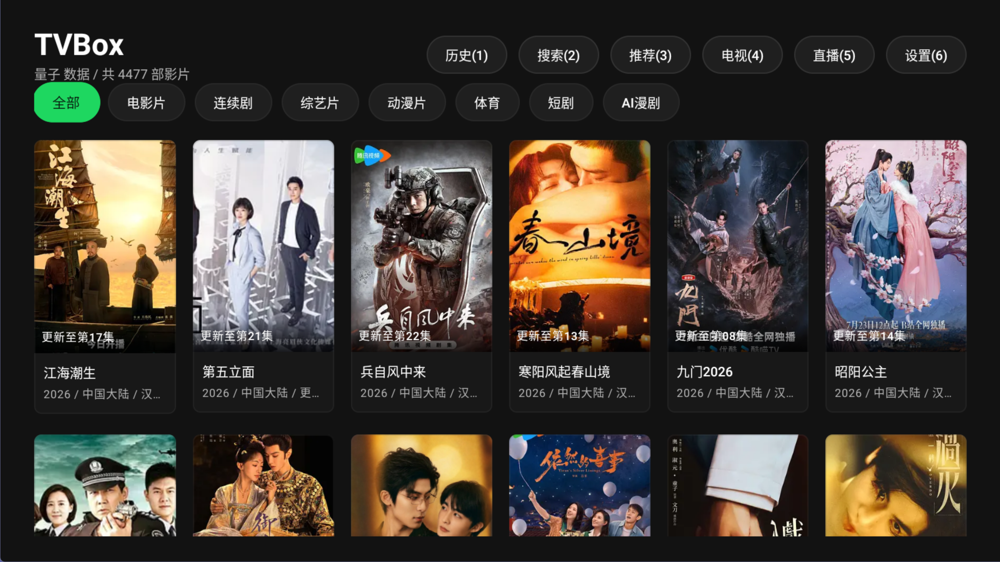

# TVBox

TVBox 是一个面向 Android TV / 电视盒子的影视播放应用，使用 Kotlin、Jetpack Compose 和 Media3 ExoPlayer 构建。应用重点适配遥控器操作，支持影视分类、搜索、详情、m3u8 播放、观看历史、电视直播和 OTA 更新。

当前源码版本为 `1.3.10`（`versionCode=10310`）。本版本完善播放控制、继续观看和首页焦点导航，统一点播与电视直播的轻量控制界面；服务端部署方式见 [多平台直播服务部署说明](platform_live_server/DEPLOYMENT.md)。

> 请确保使用的影视与直播接口具备合法授权。本项目仅提供客户端能力，不内置或托管影视内容。

## 界面预览



## 功能特性

- Android TV 适配：支持 `LEANBACK_LAUNCHER`，可在电视桌面启动，同时保留普通 Android 启动入口。
- 遥控器友好：方向键、确认键、返回键、菜单键和数字键均有对应交互。
- 首页影视列表：默认展示豆瓣热播剧集，支持海报、评分、分页加载、焦点高亮；点击热播卡片后才按片名从当前影视数据源查找详情与播放资源。
- 主题切换：设置页支持“默认主题”和“影院主题”；默认主题保留原有顶部快捷入口，影院主题提供左侧图标导航和 Hero 推荐布局。
- 视频接口管理：内置《影视线路地址整理.md》收录的 32 个资源站，并保留原有扩展线路；设置页可选择首页数据源，也可手机扫码添加 MacCms 自定义接口。
- 搜索与详情：关键词搜索最多三条来源并行，结果增量去重显示；详情页优先显示主来源，后台补齐播放源和选集。
- AI 找片：支持文字、应用内语音识别、快捷推荐词和“换一批”，可在设置页用手机扫码配置大模型、模型名和 API Key。
- 播放器：基于 Media3 ExoPlayer，仅使用其视频解码与画面窗口；TVBox 自行处理遥控器快退/快进、切集、倍速、播放暂停、自动跳下一集和手机播放手势。
- 观看历史：记录影片、封面、播放线路、集数、播放进度和更新时间；首页显示最近六部未看完的“继续观看”，原来源优先续播，备用线路后台补齐。
- 返回定位：首页、搜索和历史页面恢复滚动位置与影片焦点；“继续观看”卡片可用方向上返回顶部导航。
- 电视直播：支持 TVBox 文本与 M3U 直播源，主源不可用时自动尝试备用源；支持分组、左右切台、上下切换线路、数字选台，以及线路异常时自动换线。
- 平台直播：支持斗鱼、虎牙、哔哩哔哩、抖音和快手，统一提供平台、一级分类、二级分类、直播间和播放器流程，并按平台返回结果优先选择最高画质；直播间可在本机收藏，在直播入口的“收藏”卡片中直接打开。
- 播放亮屏：所有播放页在前台保持亮屏，暂停时同样生效；退出播放页或切到后台后恢复原设置。
- 播放中断：切到后台或发生音频焦点中断后暂停，返回后由用户手动恢复播放。
- OTA 更新：启动后检查 GitHub 仓库中的 `update.json`；系统后台下载 APK，应用内小型进度卡片不阻挡操作，校验完成后在前台自动打开系统安装器。
- 内容过滤：过滤伦理、电影解说、演员、新闻资讯等不需要的分类或资源。

## 遥控器快捷键

首页：

| 按键 | 功能 |
| --- | --- |
| 数字 1 | 历史 |
| 数字 2 | 搜索 |
| 数字 3 | AI 推荐 |
| 数字 4 | 电视直播 |
| 数字 5 | 平台直播 |
| 数字 6 | 设置 |
| 方向键 | 移动焦点 |
| 确认键 | 打开当前焦点内容 |
| 下滑到加载更多 | 自动加载下一页 |

播放器：

| 按键 | 功能 |
| --- | --- |
| 确认键 | 展开控制栏，或操作当前聚焦控件 |
| 媒体播放暂停键 | 直接播放或暂停 |
| 方向左 / 右 | 控制栏关闭时每次快退 / 快进 10 秒并支持长按；控制栏打开时导航按钮，聚焦进度条时调整进度 |
| 菜单键 | 切换倍速并显示当前倍速 |
| 数字 1 | 上一集 |
| 数字 3 | 下一集 |
| 返回键 | 依次关闭选择面板、关闭操作栏、返回详情页 |

直播：

| 按键 | 功能 |
| --- | --- |
| 方向左 / 右 | 上一个 / 下一个频道，支持首尾循环 |
| 方向上 / 下 | 切换当前频道的上一条 / 下一条线路 |
| 确认 / 播放暂停 | 显示左侧频道列表 |
| 数字键 | 输入频道号，例如 `1`、`12` |
| 返回键 | 先关闭频道列表，再返回首页 |

## 安装

从 Release 下载最新 APK：

- [Latest Release](https://github.com/ZxxXinI/tvbox/releases/latest)
- OTA 更新清单：`https://raw.githubusercontent.com/ZxxXinI/tvbox/main/update.json`

通过 ADB 安装：

```powershell
adb install -r app\build\outputs\apk\release\app-release.apk
```

如果是从 Release 下载的 APK：

```powershell
adb install -r TVBox-v1.3.10.apk
```

## OTA 更新机制

应用启动后会请求：

```text
https://raw.githubusercontent.com/ZxxXinI/tvbox/main/update.json
```

`update.json` 示例：

```json
{
  "versionCode": 10310,
  "versionName": "1.3.10",
  "apkUrl": "https://gh-proxy.org/https://github.com/ZxxXinI/tvbox/releases/download/v1.3.10/TVBox-v1.3.10.apk",
  "apkSha256": "cde557c130b3ea1b2045a0ea89f421bc3ef71756584232b5059127bee7701f87",
  "apkSize": 5001469,
  "force": false,
  "changelog": [
    "更新支持系统后台下载与小型进度卡片，校验完成后在前台自动打开安装界面。",
    "所有播放页保持亮屏，后台或音频中断后由用户手动恢复。",
    "新增轻量点播控制栏，统一电视(4)控制界面。",
    "首页增加继续观看，修复备用来源造成的4秒续播超时。",
    "恢复页面滚动位置与焦点，修复继续观看上键无法返回导航。",
    "保留数字切集、菜单倍速与连续快进，修复返回键及临时倍速恢复。"
  ]
}
```

说明：

- `versionCode` 必须大于当前应用版本，才会提示更新。
- 本次重新上传仍为 `10310 / 1.3.10`；已安装 1.3.10 的用户需手动下载新版 APK 覆盖安装，不会收到同版本 OTA 提示。
- 下载开始后关闭弹窗或按返回不取消任务；后台下载完成时，回到应用后打开安装界面。系统安装仍需用户确认，取消后可从小型进度卡片手动安装；无需悬浮窗权限。
- `apkUrl` 是 APK 下载地址，目前通过 `gh-proxy.org` 转发 GitHub Release 附件。
- `apkSha256` 用于下载完成后的完整性校验。
- `force` 预留强制更新能力，当前普通更新可选择稍后再说。
- `update.json` 放在 GitHub 仓库根目录，随 `main` 分支更新后，应用会通过 raw 地址读取。
- APK 附件上传到 GitHub Release，`update.json` 中的 `apkUrl` 指向对应 GitHub Release 附件。
- `git push` 只会上传代码和 tag，不会自动上传 Release 附件。

## 本地构建

环境要求：

- JDK 17
- Android SDK
- 使用项目内 Gradle Wrapper

AI 找片配置：

- APK 默认使用打包时配置的 `TVBOX_AI_API_KEY` 和内置 Agnes 参数。
- 用户可在设置页选择 Agnes、DeepSeek、SiliconFlow 或 Qwen。
- 模型名称和 API Key 不需要用遥控器输入；点击“模型”或“API Key”按钮后，电视会弹出二维码，手机扫码填写后自动同步到电视。
- 设置页只有手机提交了 API Key 后才会覆盖 APK 内置 AI 配置；未填写时继续使用默认配置。

打包时的默认 API Key 可放在本地配置中：

```properties
TVBOX_AI_API_KEY=你的测试密钥
```

`TVBOX_AI_API_KEY` 可以放在 `local.properties`、Gradle 属性或环境变量中。`local.properties` 已被 `.gitignore` 忽略，不会上传到仓库。

视频接口配置：

- 内置视频接口保留在 APK 中，不会被用户配置覆盖。
- 设置页“视频接口”可选择当前首页、搜索和 AI 找片使用的数据源。
- 点击“添加接口”后，电视弹出二维码；手机扫码填写接口名称和 MacCms 地址，确认后自动同步到电视。
- MacCms 地址示例：`https://example.com/api.php/provide/vod`

平台直播服务配置：

- 服务端运行在电脑或服务器上，TVBox 通过 `TVBOX_PLATFORM_LIVE_SERVICE_URL` 访问统一接口。
- 本次 v1.3.3 Debug 构建使用的服务地址为 `http://20.205.10.127:8868`。
- Windows PowerShell 临时构建配置：

```powershell
$env:TVBOX_PLATFORM_LIVE_SERVICE_URL="http://20.205.10.127:8868"
.\gradlew.bat testDebugUnitTest assembleDebug --console=plain
```

- 该变量只在构建时注入 APK，不需要写入服务器代码；服务器 Cookie 只配置在服务器环境变量中。
- 如果服务器地址变化，必须使用新地址重新构建 APK；不要填写 `localhost` 或 `127.0.0.1`。

运行测试：

```powershell
.\gradlew.bat testDebugUnitTest --console=plain
```

构建 debug APK：

```powershell
.\gradlew.bat assembleDebug --console=plain
```

构建 release APK：

```powershell
.\gradlew.bat assembleRelease --console=plain
```

release APK 输出位置：

```text
app\build\outputs\apk\release\app-release.apk
```

## Release 签名

release 签名信息从 `local.properties`、Gradle 属性或环境变量读取，密钥文件不会提交到仓库。

需要配置：

```properties
TVBOX_RELEASE_STORE_FILE=signing/xxx.jks
TVBOX_RELEASE_STORE_PASSWORD=***
TVBOX_RELEASE_KEY_ALIAS=***
TVBOX_RELEASE_KEY_PASSWORD=***
```

签名校验：

```powershell
apksigner verify --print-certs app\build\outputs\apk\release\app-release.apk
```

## 发布新版本流程

1. 更新版本号、CHANGELOG 和 README；构建签名 APK 后，根据实际 SHA-256 和大小填写根目录 `update.json`。
2. 仅暂存本次发布涉及的主工程代码及文档；如开发日志含无关修改，使用分段暂存。

```powershell
git add CHANGELOG.md README.md update.json app\build.gradle.kts app\src\main app\src\test app\src\debug devLog\home-player-ui.md devLog\playback-experience.md devLog\release.md
git add -p devLog\README.md
git commit -m "Release v1.3.10"
git tag -a v1.3.10 -m "TVBox v1.3.10"
git push origin v1.3.10
```

3. 创建草稿 Release 并上传 APK 与相同版本的 OTA 清单，检查附件完整性。

```powershell
gh release create v1.3.10 app\build\outputs\apk\release\TVBox-v1.3.10.apk app\build\outputs\apk\release\update.json --repo ZxxXinI/tvbox --verify-tag --draft --title "TVBox v1.3.10" --notes-file app\build\outputs\apk\release\release-notes.md
```

4. 公开 Release 后推送主分支，使 OTA 清单指向已经可下载的附件。

```powershell
gh release edit v1.3.10 --repo ZxxXinI/tvbox --draft=false --latest
git push origin main
```

> GitHub Release 包含对应版本的 APK 和 `update.json`；应用启动时从 GitHub `main` 分支读取更新清单。

## 项目结构

```text
app/src/main/java/com/tvbox/app
├── data        # API、仓库、历史记录、OTA、直播数据
├── domain      # 领域模型与解析规则
├── ui          # Compose 页面、播放器、直播页
└── MainActivity.kt
```

## 技术栈

- Kotlin
- Jetpack Compose
- Compose for TV 基础能力
- Media3 ExoPlayer
- Retrofit / OkHttp
- kotlinx.serialization
- Coil

## 版本记录

详细变更见 [CHANGELOG.md](CHANGELOG.md)。

## 🔗 友情链接 / Friends

- [LINUX DO](https://linux.do/) — 新的理想型社区 / A new ideal community

